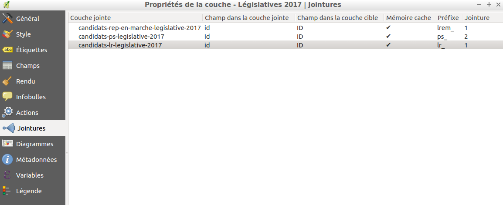
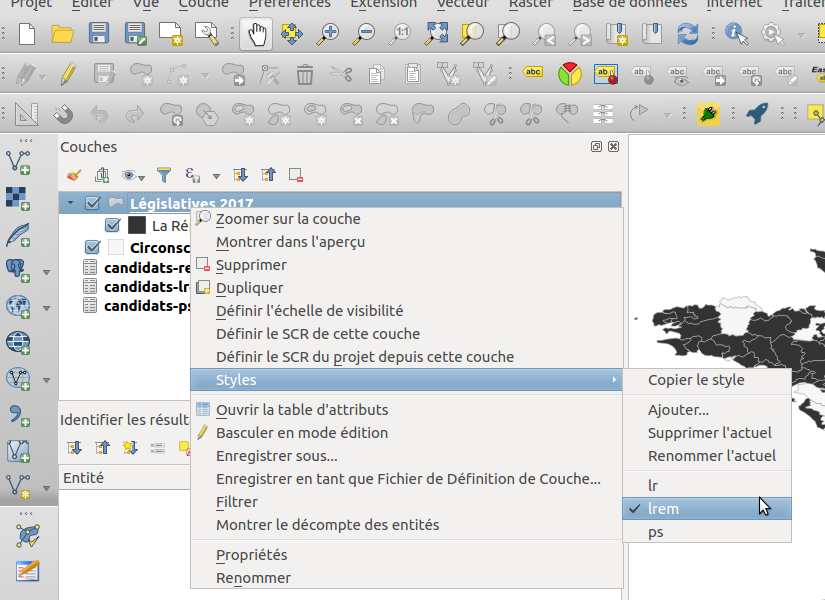
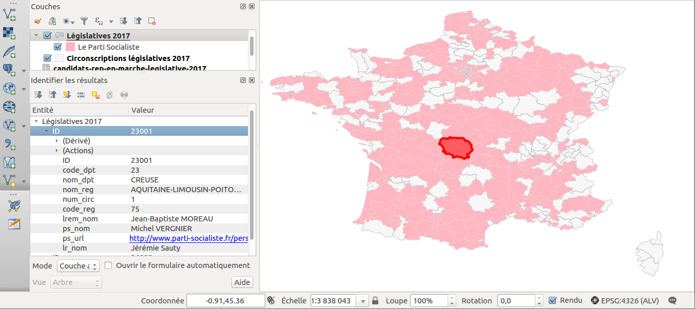
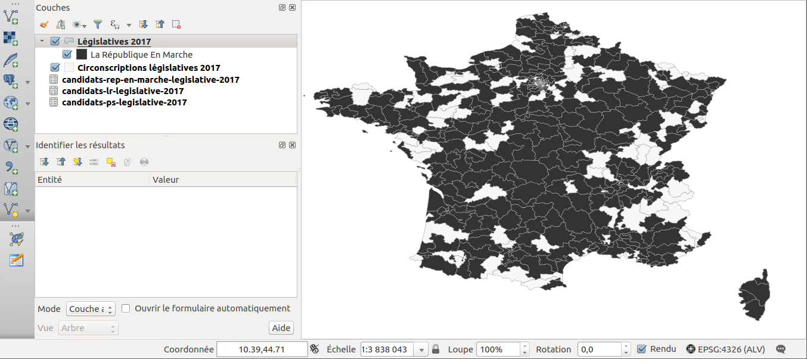
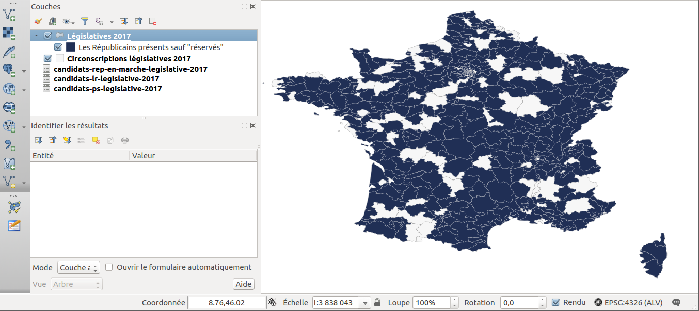

# Élections législatives 2017

Ce dépôt contient les données avec une mise en page QGIS pour les législatives 2017.

Comme les circonscriptions des Français de l'Étranger n'ont pas de représentations graphiques, elles sont présentes dans les fichiers CSV mais pas sur la carte.

## Projet QGIS

### Mise en oeuvre pratique

Installez [QGIS](http://qgis.org/fr/site/) (nous avons travaillé avec la version 2.18.7)

Il vous suffit de récupérer le code de ce dépôt (par exemple en téléchargeant le ZIP) puis d'ouvrir le projet QGIS `investitures-legislatives-2017.qgs`

Le code EPSG utilisé est 4326 qui correspond au WGS 84 (coordonnées du GPS) car la carte inclut les DOM et les COM.

Nous avons fonctionné avec des jointures avec les fichiers CSV pour chacune des formation politique (La République En Marche, Le Parti Socialiste, Les Républicains)



Nous avons pour la cartographie appliqué plusieurs styles sur la même couche "Législatives 2017". Vous pouvez basculer entre les styles.



On peut par ailleurs avec QGIS comparer pour une circonscription qui sont les candidats



### Illustrations graphiques basiques

Elles sont présentes pour vous donner un aperçu mais nous n'avons pas fait de mise en page pour l'impression, juste une pour la consultation et mettre en valeur les données.

#### La République En Marche



#### Le Parti Socialiste


#### Les Républicains




## Données

Elles proviennent:

* pour les données géographiques des circonscriptions de Science Po depuis le site [data.gouv.fr](https://www.data.gouv.fr/fr/datasets/carte-des-circonscriptions-legislatives-2012-et-2017/#discussion-5919a76788ee38302bf7b7df-2) (qui eux même se sont appuyés sur le travail de [Toxicode](http://www.toxicode.fr/circonscriptions) et de F. Rodrigo de la société Mapotempo)
* pour les données liées aux investitures des données semi-structurées fournies/extraites des sites et contenus mis à disposition par les formations politiques

### La République En Marche

Nous avons compilés les données en date du 14/05/2017 depuis le PDF de "En Marche" publié sur le site de Ouest-France sur l'article ["CARTE. Qui est le candidat de la République En Marche dans votre circonscription ?"](http://www.ouest-france.fr/elections/legislatives/carte-qui-est-le-candidat-de-la-republique-en-marche-dans-votre-circonscription-4986407)

### Le Parti Socialiste

La donnée vient du [site officiel](http://www.parti-socialiste.fr/liste-candidats-aux-legislatives-investis-ps/)
La particularité est qu'en plus du nom du candidat, on a les URL vers les profils (sauf pour 2 personnes sur l'ensemble des personnes investies par le parti)

La donnée a été obtenue avec le code JavaScript ci-dessous avec un peu de "rechercher/remplacer" et des "regex" via Sublime Text "à la mano" (automatiser à 100% n'était pas le but recherché)


```
var depts = document.querySelectorAll('li span[rel="submenu-highlander"]');

copy(Array.prototype.map.call(depts, function(e) {
  return Array.prototype.map.call(
      document.querySelectorAll('#target-' + e.id)[0].childNodes,
      function(e1) {
       if (e1.tagName == 'A') {
         return e1.textContent + ';' + e1.href;
       } else {
         if (e1.tagName == 'BR') {
           return "\n";
         } else {
           if (e1.data !== " ") {
              return e.getAttribute('title') + ';' + e1.data;
           } else {
              return 'AAAAA'
           }
         }
       }
      }
    ).join(';');
}).join('\n'));
```

### Les Républicains

La donnée vient [du site officiel](https://www.republicains.fr/actualites_liste_candidats_investis_legislatives_20170511)

Ils semblent avoir une approche où toutes les circonscriptions sont listées sur leur site. Ils utilisent quand ils n'ont pas de candidats le mot "Réservée" ce qui prête à confusion: la place est déjà "au chaud" pour quelqu'un ou bien c'est une absence de candidat de façon masquée.

## Retours/corrections

N'hésitez pas à nous contacter sur Twitter [ThomasG77](http://twitter.com/ThomasG77) ou en contribuant directement sur ce dépôt si des mises à jour, des ajouts sont à faire.
Bien que nous soyons professionnel dans le domaine des SIG/ de la cartographie, cela a été fait comme un projet "loisirs" pour favoriser la réutilisation des données pour cette législature 2017.

## Licences des données

* ODBL pour les données circonscriptions
* ODBL pour les données que nous avons compilées (cela évite les problèmes d'incompatibilité d'avoir fait ce choix)
